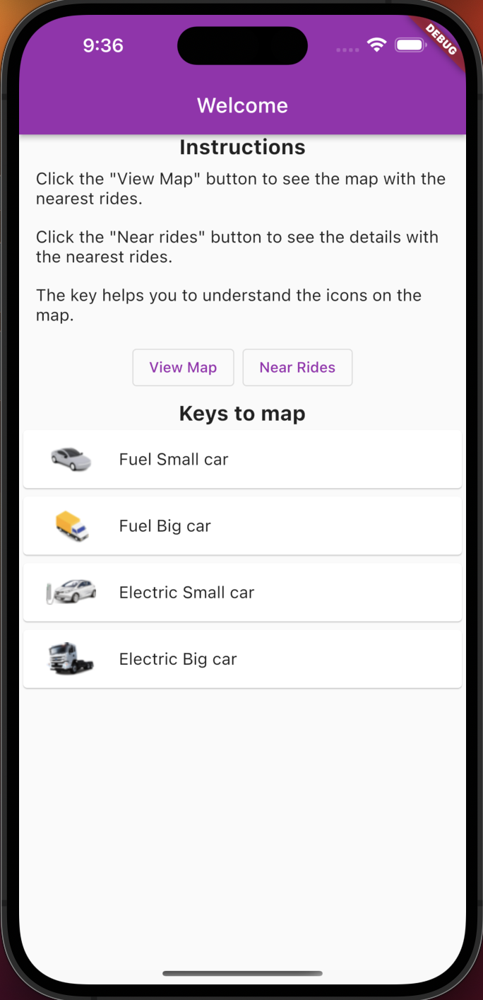
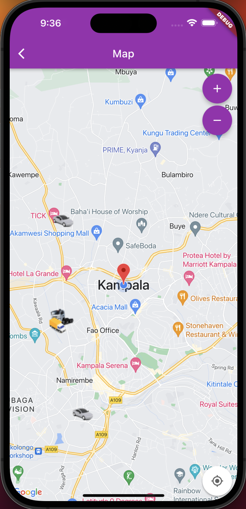
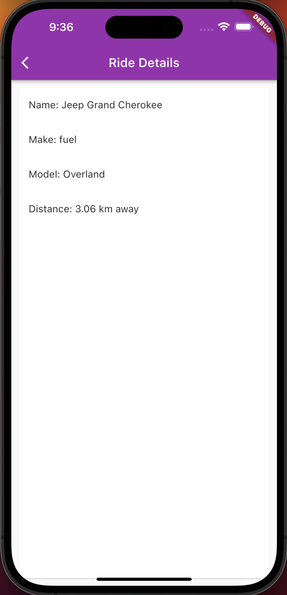
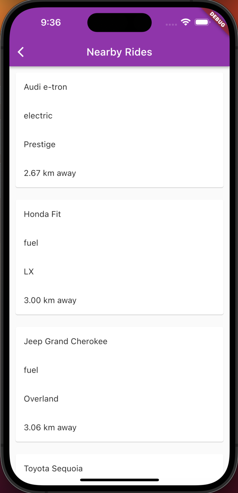

# Rides 🚗

Hi there 👋, you are viewing the rides app. This project is an app that fetches rides that are near the current User's location and displays them. It differentiates the nearby rides by their given category.

## Technology Used

- Flutter
- Firebase
- Googlemaps

## A link to the app is available here

[app](https://play.google.com/apps/internaltest/4701342705413005100)

## A small demo video can be found here

[demo](https://youtube.com/shorts/Vf8QtloBxA0?feature=share)

## Prerequisites

You need flutter installed before running this project

## Getting Started

Clone the repo

```bash
git clone https://github.com/matovu-farid/rides.git
```

Get the dependencies and run the project

```bash
  flutter pub get
  flutter run
```

## Keys to the map

- Fueled small car - 
- Fueled big car - 
- Electric small car - 
- Electric big car - 

## Screenshots






## Author

👤 **Matovu Farid Nkoba**

- GitHub: [@matovu-farid](https://github.com/matovu-farid)
- Twitter: [@matovu100](https://twitter.com/matovu100)
- LinkedIn: [matovu-farid](https://www.linkedin.com/in/matovu-farid-48b80257)

## Show your support

Give a ⭐️ if you like this project!
